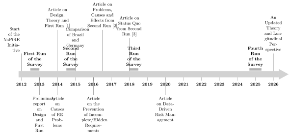

## History of NaPiRE

<!-- TODO: Replace the placeholder content below with the actual history of the initiative
     (founding year, founding members/institutions, and a timeline of survey editions). -->

**NaPiRE (Naming the Pain in Requirements Engineering)** is a global, practitioner-oriented survey initiative in requirements engineering (RE).
This page traces how the initiative came to be and how it has evolved over time.

### Motivation

[Daniel Mendez](https://www.mendezfe.org/) (Blekinge Institute of Technology, Sweden, and fortiss GmbH, Germany) and [Stefan Wagner](https://www.professoren.tum.de/wagner-stefan) (Technical University of Munich, Germany) brought the initiative to life in 2012 to study the status quo of requirements engineering in practice.
The initiative aims to provide an up-to-date, comprehensive, and representative [theory of common practice](theory.html) and contemporary problems faced in requirements engineering.
To this end, they orchestrate one of the largest research efforts in the field:
Through a recurring family of globally distributed online surveys, the NaPiRE initiative repeatedly collects the one of the largest sets of opinions on RE practice.
The resulting theory serves several purposes:

- Requirements engineering researchers shall find support for hypotheses about common practice and contemporary problems in the field. This helps empirically grounding research in actual practice.
- Requirements engineering researchers shall be able to identify relevant targets for future research by focussing on actual common practice and problems.
- Requirements engineering practitioners can compare their own way-of-working with a global census.

### Team

Capturing the diversity of requirements engineering research and practice in one shared theory requires a diverse sampling process.
This is only possible thanks to the extensive team with members from 25 countries, mostly from Europe, South America, North America, and Asia.
Over time, [Maria Teresa Baldassarre](https://www.uniba.it/it/docenti/baldassarre-maria-teresa) (University of Bari, Italy) and [Marcos Kalinoswki](https://www-di.inf.puc-rio.br/~kalinowski/) (Pontifical Catholic University of Rio de Janeiro, Brazil) joined the core team that orchestrates the large-scale initiative.

### Process

The [Status Quo Theory](theory.html) was initiated from hypotheses proposed in isolated publications in the research community. 
With every replication of the NaPiRE survey, we test each hypothesis based on the gathered data and adjust it based on our findings.
Accordingly, the survey is slightly adjusted with every iteration to reflect the updated theory but also contemporary RE phenomena.
The core team organizes these adaptations jointly in community workshops at the annual meetings of the [International Software Engineering Research Network](https://isern.iese.de/) in which we prepare each run and discuss the results of the run before.
The revised questionnaire is implemented centrally and piloted with industry partners prior to the distributed data collection.

### Iterations

There have been four completed runs of the survey:

1. The first run (2012/13) tested the survey and was distributed only in Germany and the Netherlands
2. the second run (2014/15) was then performed in 10 countries, 
3. the third run (2018) replicated this major survey, and 
4. the fourth run (2024/25) represents the most recent iteration.

### Contributions

These NaPIRE runs have produced several accessible contributions.
Among the major contributions are the following:

- The first main article [1] describes the study design, replication format, and world-wide distribuition. It proposes the first version of the status quo theory constituting several hypotheses that were tested on the full responses from 58 organizations.
- The second main article [2] processes the qualitative data from the second run to identify the relationships between root causes and effects of contemporary problems in RE.
- The most recent, completed update of the status quo theory [3] reports the results from analyzing the quantitative data from the second run.

In addition, the four runs have sparked several spin-off studies investigating specific RE phenomena.

## Publications

- [1]  Daniel Méndez Fernández and Stefan Wagner. 2015. Naming the Pain in Requirements Engineering: A Design for a global Family of Surveys and First Results from Germany. Information and Software Technology 57 (2015), 616–643. [doi:10.1016/j.infsof.2014.05.008](https://doi.org/10.1016/j.infsof.2014.05.008)
- [2] Daniel Mendez Fernandez, Stefan Wagner, Marcos Kalinowski, Michael Felderer, Priscilla Mafra, Antonio Vetrò, Tayana Conte, Marie-Therese Christiansson, Desmond Greer, Casper Lassenius, Tomi Männistö, Maleknaz Nayebi, Markku Oivo, Birgit Penzenstadler, Dietmar Pfahl, Rafael Prikladnicki, Guenther Ruhe, André Schekelmann, Sagar Sen, Rodrigo Spinola, Ahmet Tuzcu, Jose Luis de la Vara, and Roel Wieringa. 2017. Naming the pain in requirements engineering. Empirical Software Engineering 22, 5 (2017), 2298–2338. [doi:10.1007/s10664-016-9451-7](https://doi.org/10.1007/s10664-016-9451-7)
- [3] Stefan Wagner, Daniel Méndez Fernández, Michael Felderer, Antonio Vetrò, Marcos Kalinowski, Roel Wieringa, Dietmar Pfahl, Tayana Conte, Marie-Therese Christiansson, Desmond Greer, et al . 2019. Status quo in requirements engineering: A theory and a global family of surveys. ACM Transactions on Software Engineering and Methodology (TOSEM) 28, 2 (2019), 1–48. [doi:10.1145/3306607](https://doi.org/10.1145/3306607)
